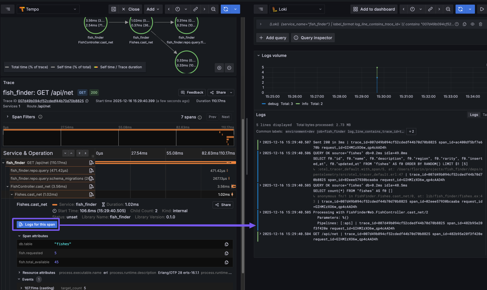

# Observatory

A Grafana-centric local observability stack for metrics, logs, and traces.

## Architecture

```text
                   Your Application
                         |
       +-----------------+-----------------+
       |                 |                 |
    Metrics           Traces             Logs
 (Prometheus)         (OTLP)         (stdout/file)
       |                 |                 |
       v                 v                 v
     Mimir         OTEL Collector   Promtail/Vector
       |                 |                 |
       +--------+--------+---------+-------+
                |                  |
                v                  v
              Tempo              Loki
                |                  |
                +--------+---------+
                         |
                      Grafana
```

## Services

| Service        | Port       | Purpose                                   |
| -------------- | ---------- | ----------------------------------------- |
| Grafana        | 3000       | Visualization dashboard                   |
| Mimir          | 9009       | Metrics storage (Prometheus remote write) |
| Tempo          | 3200       | Distributed tracing                       |
| Loki           | 3100       | Log aggregation                           |
| OTEL Collector | 4317, 4318 | Trace ingestion (OTLP gRPC/HTTP)          |
| Vector         | -          | Log collection from Docker containers     |
| Promtail       | 9080       | Log collection from files                 |

## Quick Start

### 1. Configure environment

Copy and edit the example configuration:

```bash
cp .envrc_example .envrc
```

Edit `.envrc` with your settings:

```bash
# Grafana credentials (used on first startup only)
export GRAFANA_ADMIN_USER=admin
export GRAFANA_ADMIN_PASSWORD=your_password

# Application log collection (Promtail)
export APP_NAME=myapp
export APP_ENVIRONMENT=dev
export LOGS_PATH=/path/to/your/app/log
```

If using direnv:

```bash
direnv allow
```

### 2. Start the stack

```bash
docker-compose up -d
```

Verify services are running:

```bash
docker-compose ps
```

Services may take 15-30 seconds to become fully ready.

### 3. Access Grafana

- URL: <http://localhost:3000>
- Credentials: as configured in `.envrc`

Datasources are pre-configured:

- **Prometheus (Mimir)**: for metrics
- **Loki**: for logs
- **Tempo**: for traces

## Environment Variables

| Variable                 | Default | Description                                    |
| ------------------------ | ------- | ---------------------------------------------- |
| `GRAFANA_ADMIN_USER`     | admin   | Grafana admin username                         |
| `GRAFANA_ADMIN_PASSWORD` | admin   | Grafana admin password                         |
| `APP_NAME`               | app     | Application name for log labels                |
| `APP_ENVIRONMENT`        | dev     | Environment label for logs                     |
| `LOGS_PATH`              | ./logs  | Path to application logs (mounted to Promtail) |

## Connecting Your Application

### Metrics

Push metrics to Mimir using Prometheus remote write:

- Endpoint: `http://localhost:9009/api/v1/push`
- Protocol: Prometheus remote write

### Traces

Send traces via OpenTelemetry:

- OTLP gRPC: `http://localhost:4317`
- OTLP HTTP: `http://localhost:4318`

### Logs

Two options:

1. **File-based (Promtail)**: Write logs to a file, set `LOGS_PATH` to the directory
2. **Docker (Vector)**: Logs from stdout are automatically collected from containers

## Storage

All data is stored in Docker volumes:

- `mimir-data`: Metrics
- `tempo-data`: Traces
- `loki-data`: Logs
- `grafana-data`: Dashboards and settings

To reset all data:

```bash
docker-compose down -v
```

## Troubleshooting

View service logs:

```bash
docker-compose logs -f <service>
```

Check service health:

```bash
curl http://localhost:3100/ready  # Loki
curl http://localhost:9009/ready  # Mimir
curl http://localhost:3200/ready  # Tempo
```

## Demo Application

For a practical example, take a look at [Fish Finder](https://github.com/florinpatrascu/fish_finder), a [Phoenix](https://www.phoenixframework.org) application that demonstrates best-practice integration of metrics, traces end to end, and logs. The app includes spans, events, and span-specific metadata, and comes with a curated set of dashboards, including those supplied by [PromEx](https://github.com/akoutmos/prom_ex) library.

To use with Fish Finder:

1. Start the Observatory stack first by running: `docker-compose up -d`
2. Launch the Fish Finder demo app
3. Generate some traffic; detailed instructions can be found in the [fish_finder/README](https://github.com/florinpatrascu/fish_finder/README.md)
4. Open Grafana in your browser at [localhost:3000](http://localhost:3000). Here you’ll be able to monitor your logs and traces, easily switch between them, and access a variety of Phoenix and [Ecto](https://github.com/elixir-ecto/ecto) metrics along with other insights.



## References

- [Grafana](https://grafana.com/docs/grafana/latest/)
- [Mimir](https://grafana.com/docs/mimir/latest/)
- [Tempo](https://grafana.com/docs/tempo/latest/)
- [Loki](https://grafana.com/docs/loki/latest/)
- [OpenTelemetry](https://opentelemetry.io/docs/)
